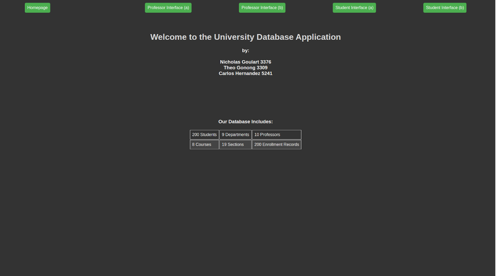
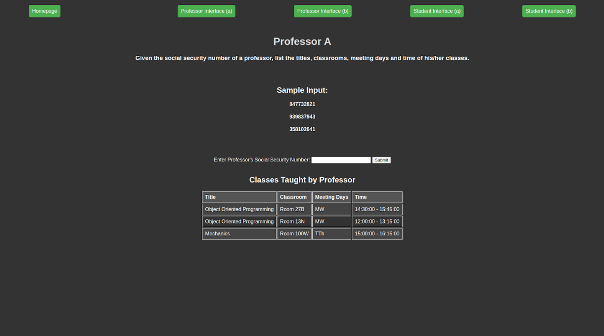
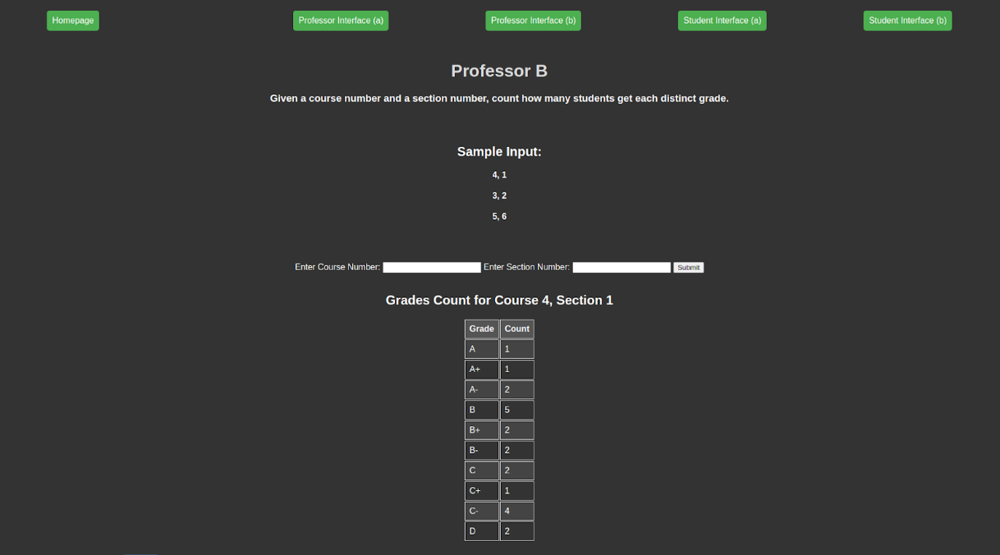
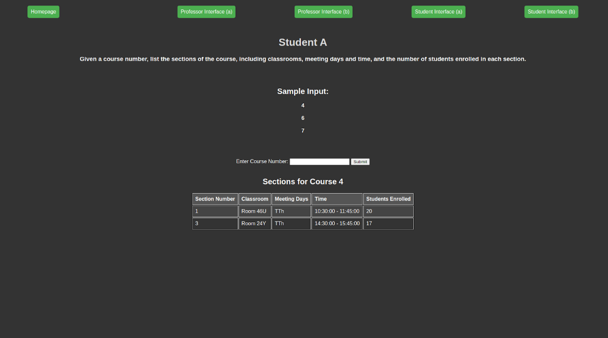
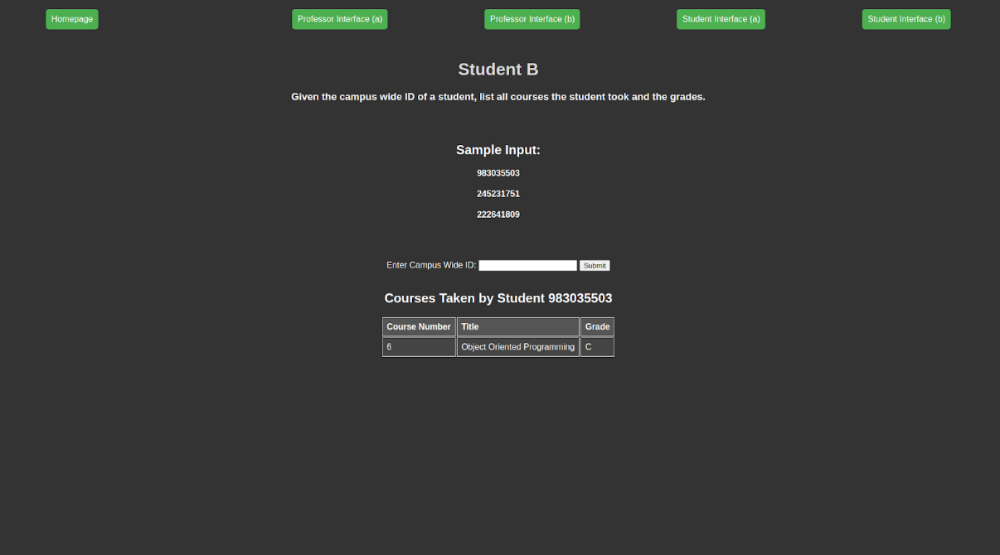

# University-Database-Project

This project is a term project for File Structures and Database Systems. The project is a web database application developed using MySQL database and PHP. The application is designed to manage university-related data using a LAMP stack (Linux, Apache, MySQL, PHP).

## Project Overview

The project involves designing and implementing a database system for a university, which includes the following requirements:

### Professor Information

- Store information about each professor, including their:
  - Social Security Number (SSN)
  - Name
  - Address
  - Telephone Number
  - Sex
  - Title
  - Salary
  - College Degrees

### Department Information

- Each department is defined by:
  - Unique Number
  - Name
  - Telephone
  - Office Location
  - Chairperson (Professor)

### Course Management

- Manage course details, including:
  - Unique Course Number
  - Title
  - Textbook
  - Units
  - Prerequisite Courses
  - Department Offering the Course

### Course Sections

- Manage different sections of courses, including:
  - Section Number
  - Course Number
  - Professor Teaching the Section
  - Classroom
  - Number of Seats
  - Meeting Days
  - Start and End Times

### Student Records

- Keep records of students, including:
  - Campus Wide ID
  - First Name
  - Last Name
  - Address
  - Telephone Number
  - Major Department
  - Minor Department (optional)

### Enrollment Records

- Store enrollment records, including:
  - Student ID
  - Course Section Number
  - Grade

## Database Schema

The database schema includes tables for professors, departments, courses, sections, students, and enrollment records. Primary keys and foreign keys are defined to establish relationships between tables.

## Implementation Details

The project's implementation includes the following components:

- SQL scripts for database table creation (DDL)
- SQL queries for database operations
- PHP scripts for user interfaces
- Screenshots of the developed interfaces
- Sample runs of the system with inputs and outputs

## Usage

### For Professors

- **Query Professor's Classes:** Given a professor's SSN, list the titles, classrooms, meeting days, and times of their classes.
- **Count Student Grades:** Given a course number and section number, count how many students received each distinct grade (e.g., 'A', 'B+', 'C-').

### For Students

- **List Course Sections:** Given a course number, list the sections of the course, including classrooms, meeting days, times, and the number of enrolled students.
- **View Transcript:** Given a student's campus-wide ID, list all courses the student has taken and the corresponding grades.

## Screenshots

